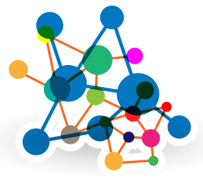
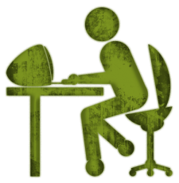
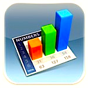

<table  class=paddingBetweenCols>

<tr><td>
<h3> My research: </h3>
</td><td>
<h3> For students:</h3>
</td><td>
<h3>For industry:</h3>
</td></tr>

<tr><td>

</td><td>

</td><td>

</td></tr>

<tr><td valign=top>
I explore SE, data mining, AI, search-based SE, open access science.

</td><td valign=top>
I need motivated and talented graduate  students for AI+SE. 
 Is that you?

</td><td valign=top>
Ask me how to innovate.  On time.  On budget. 
</td></tr>
<tr><td valign=top>
<ul>
<li> <a href="goals.html">Research goals</a></li>
<li> <a href="https://scholar.google.com/citations?user=7htTUTgmLtUC&hl=en&oi=ao">Papers</a></li>
<li> <a href="https://docs.google.com/spreadsheets/d/1oWGEfEdt4aXZ_chBLTzw2RkKhGTKIKReetkcb8Zo2F4">Students</a></li>
<li> <a href="https://docs.google.com/spreadsheets/d/1Y5YrD3WkZlee7LLXLN5m9vvMPL2qBU-vruHpRr77dqg/edit#gid=676744746">Funding</a></li>
<li> <a href="http://openscience.us/repo">Data, on-line</a></li>
</ul>
</td><td valign=top>
<ul>
<li> <a href="https://www.youtube.com/watch?v=LRoI-Rw4GBY">Why NC State?</a>
<li> <a href="http://ai4se.net/projects">My projects</a>
<li> <a href="http://ai4se.net">My lab</a>
<li> <a href="application.html">How to apply?</a>
</ul>
</td><td valign=top>

Case studies:

<ul>
<li><a href="https://www.sbir.gov/sbirsearch/detail/4945">Grammatech</a></li>
<li>Lexis Nexis: <a href="http://www.slideshare.net/slideshow/embed_code/key/f8etbZ448ukfOs">1</a>, <a href="pdf/Best_Practice_SE_text_mining.pdf">2<a> </li>
<li><a href="http://www.slideshare.net/timmenzies/172529main-ken-andtimsoftwareassuranceresearchatwestvirginia?qid=4ddfaa48-dea3-4397-800b-74170c2722da&v=&b=&from_search=4">NASA</a></li>
<li><a href="https://github.com/timm/16/blob/master/matt.pdf">IBM</a></li>
</ul>
</td></tr>
</table>

Current projects:

- <a href="http://openscience.us/repo">Methods for open science</a>
- <a href="http://tiny.cc/factorg">Case studies in industrial data mining</a>
- <a href="http://menzies.us/pdf/15lace2.pdf">Data sharing and privacy</a>
-  <a href="https://docs.google.com/presentation/d/145_yPZnx65Z-TOW3_Y9HcLqbEm39QZD1oZMksI8FqW4/edit#slide=id.gc6f980f91_0_29">Text mining: active learning, crowd-sourcing</a>
- <a href="http://www.slideshare.net/timmenzies/gale-geometric-active-learning-for-searchbased-software-engineering">Multi-objective optimization</a>
- <a href="http://tiny.cc/fss16">Foundation of software science: the textbook</a>
- <a href="https://raw.githubusercontent.com/timm/timm.github.io/master/pdf/16tunelearner.pdf">Learning how to make learners smarter (hyperparameter optimization)</a>
- Transfer learning: <a href="http://dl.acm.org/citation.cfm?id=2970339">bellwethers</a>, heterogeneous data
- From prediction to planning
- <a href="http://arxiv.org/pdf/1609.00489">Effort estimation</a>
- Belief and proof in software engineering.

